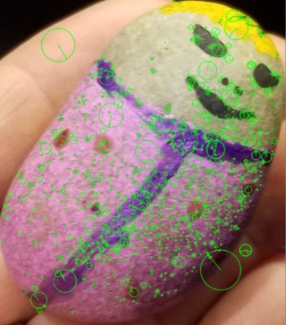
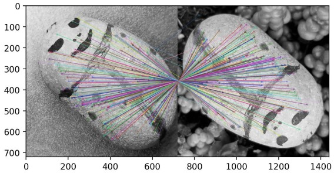

### How it works:

1.  Images are stored in the "imagesdb" directory
2.  writekp.py extracts the keypoint descriptors of all images in the database, and saves them in a file (images.pkl) for later use

3.  Tyler2.py takes a query image as input, and returns the best match (based on the highest number of matching descriptors)

#### Notes:

All images need to be cropped, but there are no size, scale, or rotation constraints

#### References:

https://github.com/lapa19/Image-Search#image-search

https://github.com/lapa19/Image-Annotation