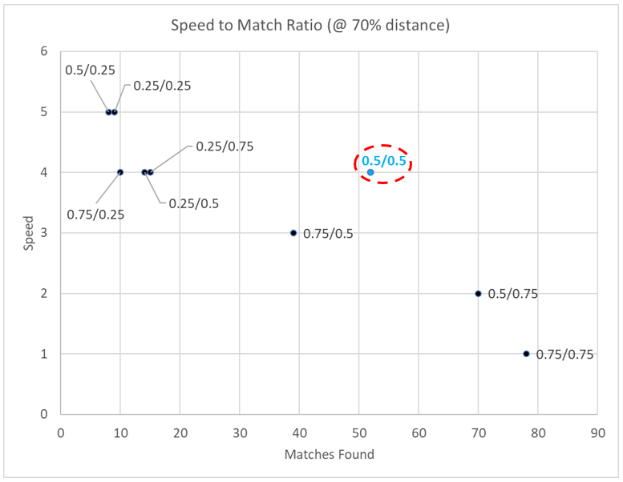
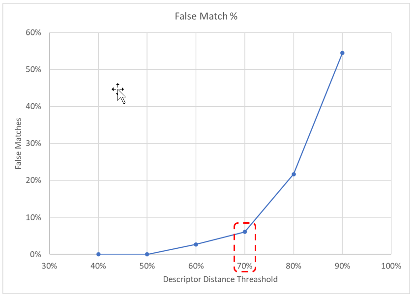
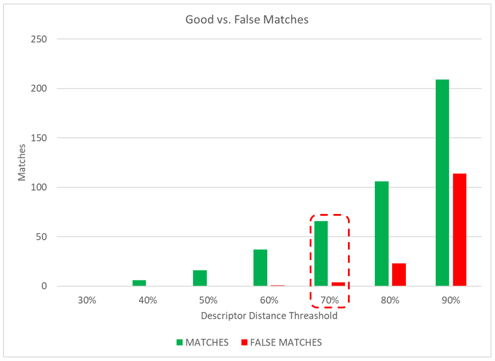
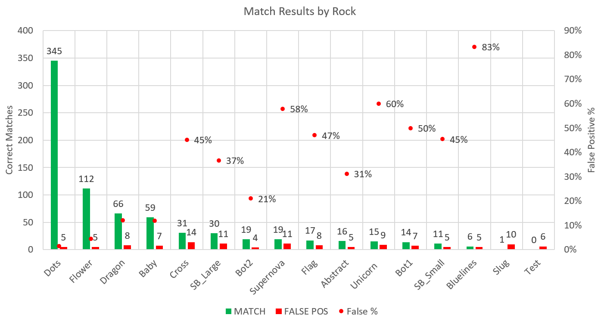

### How it works:

1.  Images are stored in the "imagesdb" directory
2.  writekp.py extracts the keypoint descriptors of all images in the database, and saves them in a file (images.pkl) for later use

3.  Tyler2.py takes a query image as input, and returns the best match (based on the highest number of matching descriptors)

#### Notes:

All images need to be cropped, but there are no size, scale, or rotation constraints

While the algorithm works well handling scale and rotation (z-axis), it seems to
struggle when the rock is rotated around the x or y-axis.  May need to
encourage users to take pictures at 90 degrees to the rock surface.

The algorithm also seems sensitive to camera shaking (blurry images) and
glossy coatings.  "Hold camera steady, and try to avoid glares."

Image compression and the descriptor distance threshold have a significant
effect on speed and performance.  Optimal values appear to be 50% compression, 
and 70% descriptor distance.  Results below.

#### References:

https://github.com/lapa19/Image-Search#image-search

https://github.com/lapa19/Image-Annotation